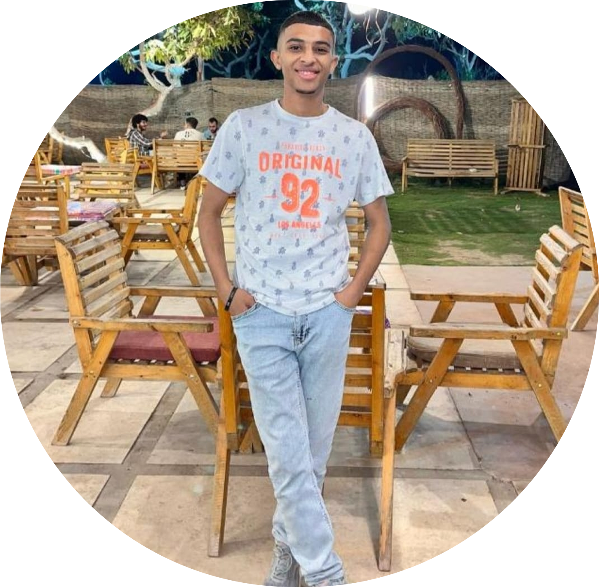
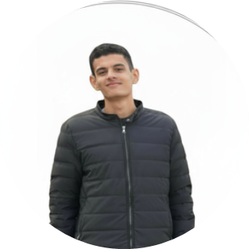
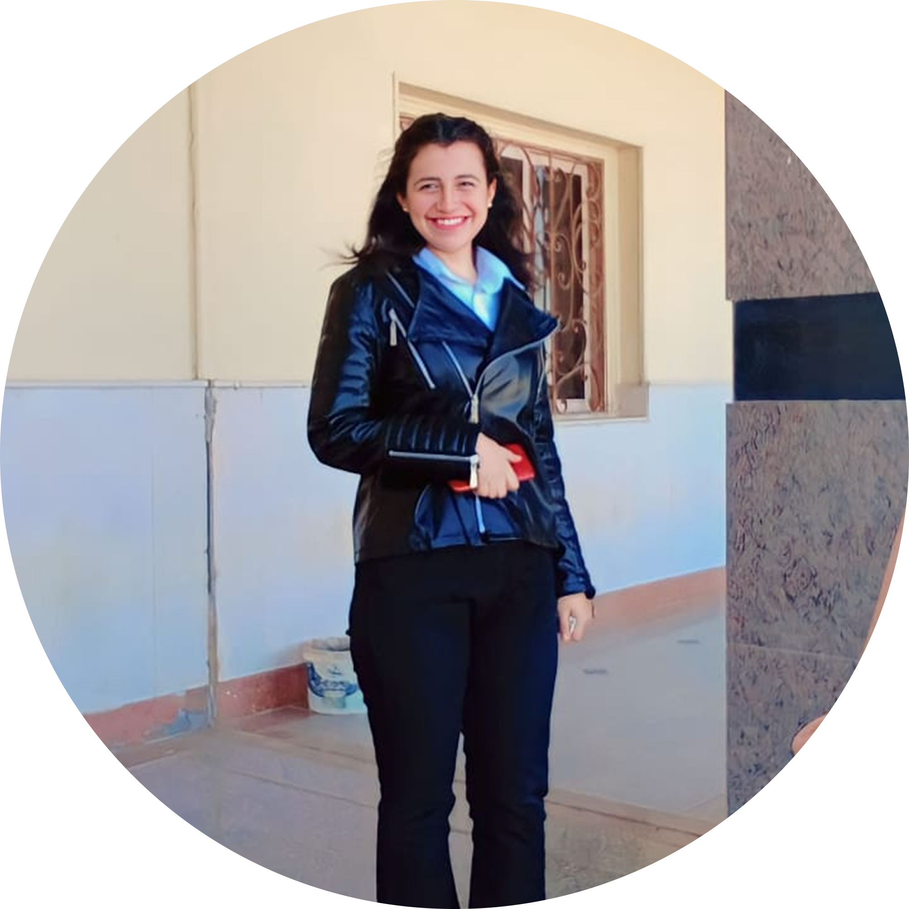

<div align="center">

<h1>🏥 Smart Medical Sample Transport System</h1>

<p>
  <strong>An end-to-end autonomous robotic ecosystem for hospital sample logistics</strong><br/>
  Spanning mobile application development · backend engineering · real-time IoT communication · embedded robotics
</p>

<p>
  
  
  
  
  
  
</p>

<p>
  
  
  
  
  
  
</p>

</div>

---

## 📖 Table of Contents

- [Overview](#-overview)
- [System Architecture](#-system-architecture)
- [End-to-End Workflow](#-end-to-end-workflow)
- [Repository Structure](#-repository-structure)
- [Modules](#-modules)
  - [Mobile Application (Flutter)](#1--mobile-application-flutter)
  - [Backend Server (Django)](#2--backend-server-django)
  - [MQTT Communication Layer](#3--mqtt-communication-layer)
  - [IoT / Embedded Layer](#4--iot--embedded-layer)
- [Technology Stack](#-technology-stack)
- [Getting Started](#-getting-started)
  - [Backend Setup](#backend-setup-medical_robot)
  - [Mobile App Setup](#mobile-app-setup-smart_midecal_transport_app)
  - [IoT / RPi Setup](#iot--rpi-setup-embedded--iot)
- [API Documentation](#-api-documentation)
- [MQTT Topic Reference](#-mqtt-topic-reference)
- [Contributors](#-contributors)

---

## 🌐 Overview

In hospitals, transporting medical samples (blood specimens, lab materials, small medical items) between doctors' rooms and the central lab is traditionally done manually — by nurses or porters walking samples from room to room. This process is **slow**, **error-prone**, and consumes valuable staff time that should be spent on direct patient care.

The **Smart Medical Sample Transport System** eliminates this bottleneck by deploying an **autonomous mobile robot** that physically navigates hospital corridors, picks up and delivers samples on demand, and is fully coordinated through a software ecosystem connecting doctors, storage staff, and administrators in real time.

### Key Benefits

| Benefit | Description |
|---|---|
| ⏱️ **Speed** | Eliminates wait times for manual transport; robot dispatches on-demand |
| 🔍 **Traceability** | Every request, pickup, and delivery is logged and timestamped |
| 🧾 **Accountability** | Explicit human confirmation required for every delivery — no assumed handoffs |
| 💰 **Affordable** | Built on Raspberry Pi + ATmega rather than expensive proprietary robotics |
| 📱 **Accessibility** | Full-featured mobile app for all three staff roles |

---

## 🏗️ System Architecture

The system is composed of **four tightly integrated layers**:

```
┌─────────────────────────────────────────────────────────────────┐
│                    MOBILE APPLICATION                           │
│              Flutter (Doctor · Storage · Admin)                 │
└──────────────────────────┬──────────────────────────────────────┘
                           │  REST API + JWT
┌──────────────────────────▼──────────────────────────────────────┐
│                     BACKEND SERVER                              │
│       Django + DRF · JWT Auth · Business Logic · SQLite         │
└──────────────────────────┬──────────────────────────────────────┘
                           │  MQTT Publish / Subscribe
┌──────────────────────────▼──────────────────────────────────────┐
│                    MQTT BROKER (HiveMQ)                         │
│          dispatch/ · acknowledgement/ · arrival/ · control/     │
└──────────────────────────┬──────────────────────────────────────┘
                           │  MQTT Topics
┌──────────────────────────▼──────────────────────────────────────┐
│                  IoT / EMBEDDED ROBOT                           │
│   ┌─────────────────────────┐   ┌─────────────────────────┐    │
│   │   Raspberry Pi          │◄──►   ATmega MCU             │    │
│   │  (High-Level Brain)     │UART│ (Real-Time Control)      │    │
│   │  · MQTT client          │   │ · Motor drivers           │    │
│   │  · State machine        │   │ · IR line sensors         │    │
│   │  · Camera + OCR         │   │ · Intersection detection  │    │
│   │  · IMU / Gyroscope      │   │ · Buzzer signalling       │    │
│   └─────────────────────────┘   └─────────────────────────┘    │
└─────────────────────────────────────────────────────────────────┘
```

---

## 🔄 End-to-End Workflow

```
Doctor opens app → Creates sample pickup request
        │
        ▼
Storage staff views all pending requests
        │
        ▼
Storage staff curates a delivery batch & dispatches the robot
        │
        ▼
Backend sends dispatch payload to robot over MQTT
        │
        ▼
Robot drives corridor → IR sensors follow floor line
        │
        ▼
Camera + OCR reads room number at each intersection
        │
        ▼
On match: Robot rotates 90° (IMU-controlled) → approaches door
        │
        ▼
Backend notified of arrival → Push notification sent to doctor
        │
        ▼
Doctor confirms sample received (or reports missing)
        │
        ▼
App prompts: "Send a return sample on this same trip?"
        │
        ├── Yes → Doctor selects sample → included in return batch
        │
        ▼
Backend sends "proceed" command → Robot reverses, re-enters corridor
        │
        ▼
Continues to next room OR returns to storage
        │
        ▼
Storage staff notified: robot is idle & ready for next batch
        │
        ▼
Admin monitors system-wide statistics; can halt dispatch at any time
```

---

## 📂 Repository Structure

```text
Smart-medical-sample-transport-system/
│
├── Medical_Robot/                   # Django REST API backend
│   ├── accounts/                    # User auth, JWT, role management
│   ├── analytics/                   # Statistics and reporting
│   ├── cars/                        # Robot/cart management
│   ├── common/                      # Shared utilities
│   ├── dashboard/                   # Admin dashboard views
│   ├── healthcare/                  # Wards and hospital entities
│   ├── restrictions/                # Account restriction controls
│   ├── samples/                     # Sample lifecycle management
│   ├── transport/                   # Request batching & dispatch logic
│   ├── Medical_Robot/               # Django project settings
│   ├── manage.py
│   ├── requirements.txt
│   ├── db.sqlite3                   # SQLite database (development)
│   ├── openapi.json                 # OpenAPI schema
│   └── mqtt-flow.md                 # MQTT flow documentation
│
├── Flutter/     # Flutter cross-platform mobile app
│   ├── lib/                         # Dart source code
│   ├── assets/                      # Images, fonts, localization
│   ├── android/ · ios/ · web/       # Platform-specific configs
│   └── pubspec.yaml
│
├── Embedded/                        # Robot embedded software
│   ├── rpi/                         # Raspberry Pi Python modules
│   │   ├── rpi_main.py              # Main state machine controller
│   │   ├── mqtt_controller.py       # MQTT client (dispatch / control)
│   │   ├── uart_controller.py       # Serial comms with ATmega
│   │   ├── camera_module.py         # OpenCV + OCR room detection
│   │   └── functons.py              # IMU / helper utilities
│   ├── Car_main_controller/         # ATmega C firmware
│   ├── Line_Follower_Logic.h        # IR sensor line-following logic
│   └── gyroscope.txt                # IMU integration notes
│
├── Iot/                             # IoT bridge scripts
│   ├── ledcontrol.py                # LED status bridge (MQTT ↔ GPIO)
│   ├── IoT opencv final             # Final OpenCV integration
│   └── led_control_backend_atmega   # Backend-ATmega LED control
│
├── Protous/                         # Proteus circuit simulation files
│
└── README.md
```

---

## 🧩 Modules

### 1. 📱 Mobile Application (Flutter)

> **Location:** `Flutter/`

A cross-platform mobile application targeting **Android and iOS** from a single codebase. The app enforces strict role-based routing — each user type receives a completely separate, purpose-built interface upon login.

#### Tech Stack
`Flutter` · `Dart` · `BLoC (State Management)` · `Dio (Networking)` · `GetIt (DI)` · `Easy Localization` · `Firebase Push Notifications`

#### User Roles & Features

<details>
<summary><strong>🩺 Doctor Interface</strong></summary>

| Tab | Description |
|---|---|
| **Home** | Personal statistics dashboard — total requests, completed, cancelled, history at a glance |
| **Request** | Submit a new sample pickup request from a specific room |
| **Requested Samples** | Live list of active requests; cancel any pending request before robot arrives |
| **Profile** | Account management and personal settings |

**Notification Flow:**
1. Push notification fires when the robot physically arrives at the doctor's room.
2. Doctor confirms sample receipt (or marks it as missing) — explicit confirmation required.
3. Immediate follow-up popup offers to **send a return sample on the same robot visit**, selecting from samples currently in the room. This eliminates the need for a dedicated return trip.

</details>

<details>
<summary><strong>🏪 Storage Staff Interface</strong></summary>

| Feature | Description |
|---|---|
| **Dashboard** | Personal activity stats (mirrors doctor dashboard, tracks storage performance) |
| **View Requests** | All incoming sample requests from doctors across all rooms |
| **Build Batch** | Add / remove specific samples to curate the next delivery run |
| **Dispatch Car** | One-tap action that triggers the robot to begin its route |
| **Return Notification** | Push notification fires when robot arrives back at storage and is idle |

</details>

<details>
<summary><strong>🛡️ Admin Interface</strong></summary>

| Feature | Description |
|---|---|
| **Analytics Dashboard** | System-wide statistics filterable by: Last Year · Last Month · All Time |
| **Account Restrictions** | Suspend or restrict specific doctor or storage accounts |
| **Force Stop Dispatch** | Remotely halt any active robot route — critical safety override |

</details>

---

### 2. ⚙️ Backend Server (Django)

> **Location:** `Medical_Robot/`

The coordination core of the entire system — responsible for authentication, business logic, the full sample lifecycle, notification triggering, and acting as the bridge between the mobile app and the physical robot.

#### Tech Stack
`Python` · `Django 5.2` · `Django REST Framework 3.16` · `SimpleJWT 5.5` · `paho-mqtt 2.1` · `drf-spectacular` · `SQLite` · `django-cors-headers`

#### Django Apps

| App | Responsibility |
|---|---|
| `accounts` | User registration, JWT login/refresh, role-based permissions (Doctor · Storage · Admin) |
| `cars` | Robot/cart entity management, dispatch tracking |
| `healthcare` | Wards, rooms, hospital structural entities |
| `samples` | Sample records, status lifecycle (requested → picked up → delivered → returned) |
| `transport` | Batch creation, dispatch coordination, MQTT command publishing |
| `restrictions` | Account suspension and reinstatement controls |
| `analytics` | Aggregated statistics with time-range filtering |
| `dashboard` | Admin-facing overview views |
| `common` | Shared base models, mixins, and utilities |

#### Authentication & Security

- **JWT (JSON Web Tokens)** via `djangorestframework-simplejwt`
- Stateless, signed tokens carry user identity and role on every request
- Role-based permission classes enforce endpoint access:
  - A doctor **cannot** access dispatch controls or admin restrictions
  - Storage staff **cannot** access analytics dashboards
  - Admins have full read access across all resources

#### Database

**SQLite** (`db.sqlite3`) — used for development and demonstration. Designed for straightforward migration to PostgreSQL or MySQL in a production deployment by changing a single `DATABASES` setting in Django.

---

### 3. 📡 MQTT Communication Layer

> **Protocol:** MQTT (Message Queuing Telemetry Transport)  
> **Broker:** HiveMQ Cloud  
> **Library:** `paho-mqtt 2.1.0`

MQTT was chosen for robot↔backend communication because it is **lightweight**, **low-bandwidth**, and designed specifically for real-time IoT pub/sub messaging — perfect for the asynchronous, event-driven nature of this system (the robot cannot always move immediately; it must wait for human confirmation before proceeding).

#### Topic Architecture

| Direction | Topic | Payload | Description |
|---|---|---|---|
| Backend → Robot | `dispatch/` | JSON batch (rooms + sample IDs) | Tells robot which rooms to visit and in what order |
| Robot → Backend | `acknowledgement/` | Dispatch ID | Robot confirms it received and accepted a dispatch |
| Robot → Backend | `arrival/` | Room ID + fulfilled request IDs | Robot reports physical arrival at a room or storage |
| Backend → Robot | `control/` | `proceed` + next destination | Clears robot to leave current room and continue |

> See [`Medical_Robot/mqtt-flow.md`](Medical_Robot/mqtt-flow.md) for the full topic payload schemas and flow diagrams.

---

### 4. 🤖 IoT / Embedded Layer

> **Location:** `Embedded/`

The physical robot — the most technically demanding part of the project, spanning two hardware tiers working in tight coordination.

#### 4.1 Raspberry Pi — High-Level Brain (`Embedded/rpi/`)

| Module | Responsibility |
|---|---|
| `rpi_main.py` | **Master state machine** — drives the entire robot lifecycle: Idle → Dispatched → Moving → Scanning → Arriving → Waiting → Returning → Storage |
| `mqtt_controller.py` | MQTT client — subscribes to dispatch/control topics, publishes arrival/acknowledgement events |
| `uart_controller.py` | Serial (UART) interface to ATmega — sends movement commands, receives intersection stop signals |
| `camera_module.py` | **OpenCV + OCR room recognition** — reads room number signage at intersections, validates against expected target before stopping |
| `functons.py` | IMU integration utilities for precise 90° rotation using gyroscope angular velocity |

**Key Behaviors:**
- **Camera + OCR Localization:** At every intersection, the camera reads the printed room number using OCR. The robot only stops if the detected number matches its current target room — otherwise it continues forward automatically. No expensive localization hardware required.
- **IMU-Controlled Rotation:** After confirming the correct room, the robot rotates 90° to face the door. The gyroscope's angular velocity is integrated in real time to measure exact rotation degrees — guaranteeing a consistent, accurate turn regardless of battery level, motor speed variance, or floor friction.
- **Return Routing (Skip-N Logic):** When returning to storage from a mid-corridor room, the robot can skip over N intersections rather than stopping at each one, computing the correct number of corridors to bypass to reach the storage room directly.

#### 4.2 ATmega Microcontroller — Real-Time Control (`Embedded/Car_main_controller/`)

The ATmega handles all time-critical, low-latency physical control — tasks that a general-purpose Linux SBC (the Raspberry Pi) cannot handle reliably due to OS scheduling jitter.

| Function | Detail |
|---|---|
| **Motor Control** | Direct H-bridge motor driving: forward, backward, left turn, right turn, stop |
| **IR Line Following** | Continuously polls IR sensors mounted under the chassis; makes constant micro-corrections to stay centered on the floor line |
| **Intersection Detection** | Both left and right IR sensors simultaneously detect a crossing line → hard stop at that point and signals RPi via UART |
| **Skip-N Intersections** | Executes a "pass-through N intersections" command from RPi for direct return routing |
| **UART Communication** | Receives high-level commands from RPi, sends acknowledgements and stop signals back |
| **Buzzer** | Audible arrival alert at each room — physical cue in addition to the digital push notification |

#### Why Two Boards?

> This two-tier hardware design is a deliberate engineering decision. The Raspberry Pi is excellent for Python, networking, camera processing, and OCR — but it is **not a real-time system** and can suffer timing jitter under load. The ATmega is a dedicated microcontroller that polls sensors and drives motors with tight, predictable timing — exactly what stable line-following and accurate intersection detection require. This split-responsibility pattern is common and proven in production robotics and demonstrates an understanding of selecting the right tool for each job.

---

## 🛠️ Technology Stack

| Layer | Technology | Version |
|---|---|---|
| Mobile App | Flutter / Dart | 3.8.1+ |
| Backend Framework | Django | 5.2.7 |
| REST API | Django REST Framework | 3.16.1 |
| Authentication | SimpleJWT | 5.5.1 |
| Database | SQLite | (built-in) |
| MQTT Client (Backend & RPi) | paho-mqtt | 2.1.0 |
| MQTT Broker | HiveMQ Cloud | — |
| API Documentation | drf-spectacular (OpenAPI 3) | 0.29.0 |
| CORS | django-cors-headers | 4.9.0 |
| RPi Language | Python | 3.x |
| MCU Language | C (Atmel Studio) | — |
| Computer Vision | OpenCV + OCR | — |
| Embedded MCU | ATmega (AVR) | — |
| SBC | Raspberry Pi | — |

---

## 🚀 Getting Started

### Backend Setup (`Medical_Robot/`)

**Prerequisites:** Python 3.x, pip

```bash
# 1. Navigate to the backend directory
cd Medical_Robot

# 2. Create and activate a virtual environment (recommended)
python -m venv venv
source venv/bin/activate        # Linux / macOS
venv\Scripts\activate           # Windows

# 3. Install all dependencies
pip install -r requirements.txt

# 4. Apply database migrations
python manage.py migrate

# 5. (Optional) Create a superuser for the Django admin panel
python manage.py createsuperuser

# 6. Start the development server
python manage.py runserver
```

The server will be available at `http://127.0.0.1:8000/`

> **API Docs:** Swagger UI is available at `http://127.0.0.1:8000/api/schema/swagger-ui/`

---

### Mobile App Setup (`Flutter/`)

**Prerequisites:** Flutter SDK 3.8.1+, Dart SDK

```bash
# 1. Navigate to the mobile app directory
cd Flutter

# 2. Fetch all Flutter package dependencies
flutter pub get

# 3. (Optional) Verify your environment
flutter doctor

# 4. Run on a connected device or emulator
flutter run
```

To build a release APK:
```bash
flutter build apk --release
```

---

### IoT / RPi Setup (`Embedded/` · `Iot/`)

**Prerequisites:** Raspberry Pi with Python 3.x, connected to the same network as the MQTT broker

```bash
# 1. Navigate to the RPi module directory
cd Embedded/rpi

# 2. Install required Python packages
pip install paho-mqtt opencv-python RPi.GPIO pyserial

# 3. Configure MQTT broker credentials
#    Edit mqtt_controller.py and set:
#      BROKER_HOST = "<your-hivemq-host>"
#      BROKER_PORT = 8883
#      USERNAME    = "<your-mqtt-username>"
#      PASSWORD    = "<your-mqtt-password>"

# 4. Run the main robot controller
python rpi_main.py
```

For the ATmega firmware, open `Embedded/Car_main_controller_C.atsln` in **Atmel Studio**, build the project, and flash to the ATmega board via your programmer.

---

## 📄 API Documentation

The backend exposes a fully documented REST API using **OpenAPI 3 / Swagger** via `drf-spectacular`.

| Endpoint | Description |
|---|---|
| `/api/schema/swagger-ui/` | Interactive Swagger UI |
| `/api/schema/redoc/` | ReDoc alternative view |
| `/api/schema/` | Raw OpenAPI JSON schema |

The static schema file is also available at [`Medical_Robot/openapi.json`](Medical_Robot/openapi.json).

---

## 📡 MQTT Topic Reference

> Full payload schemas are documented in [`Medical_Robot/mqtt-flow.md`](Medical_Robot/mqtt-flow.md).

```
Backend ──────► carts/{cart_id}/dispatch        ► Robot receives delivery batch
Robot   ──────► carts/{cart_id}/acknowledgement ► Robot confirms dispatch received
Robot   ──────► carts/{cart_id}/arrival         ► Robot reports room/storage arrival
Backend ──────► carts/{cart_id}/control         ► Backend sends proceed/stop command
```

---

## 👥 Contributors

<table>
  <tr>
    <td align="center" width="25%">
      <br/>
      <b>Khalid Abdelrazk (Team Leader)</b><br/>
      Flutter & Embedded Systems Engineer
    </td>
    <td align="center" width="25%">
      <br/>
      <b>Menna Tallah Khaled</b><br/>
      IoT & Embedded Systems Engineer
    </td>
    <td align="center" width="25%">
      <br/>
      <b>Mohammed Fadel</b><br/>
      IoT & Embedded Systems Engineer
    </td>
    <td align="center" width="25%">
      <br/>
      <b>Nader Ahmed</b><br/>
      Embedded Systems Engineer
    </td>
  </tr>
  <tr>
    <td align="center" width="25%">
      <br/>
      <b>Mohammed Ashraf</b><br/>
      Back-End Developer
    </td>
    <td align="center" width="25%">
      <br/>
      <b>Shahd Hegazy</b><br/>
      Back-End Developer
    </td>
    <td align="center" width="25%">
      <br/>
      <b>Merna Ezzat</b><br/>
      Back-End Developer
    </td>
    <td align="center" width="25%">
      <br/>
      <b>Mohmmed Tarek</b><br/>
      Flutter Developer
    </td>
  </tr>
</table>

<div align="center">

**Smart Medical Sample Transport System** — Graduation Project

*Bridging mobile software, cloud backends, real-time IoT communication, and embedded robotics into one cohesive healthcare automation pipeline.*

---

<sub>Built with ❤️ as a graduation project demonstrating full-stack and systems engineering across mobile, backend, IoT, and robotics domains.</sub>

</div>
